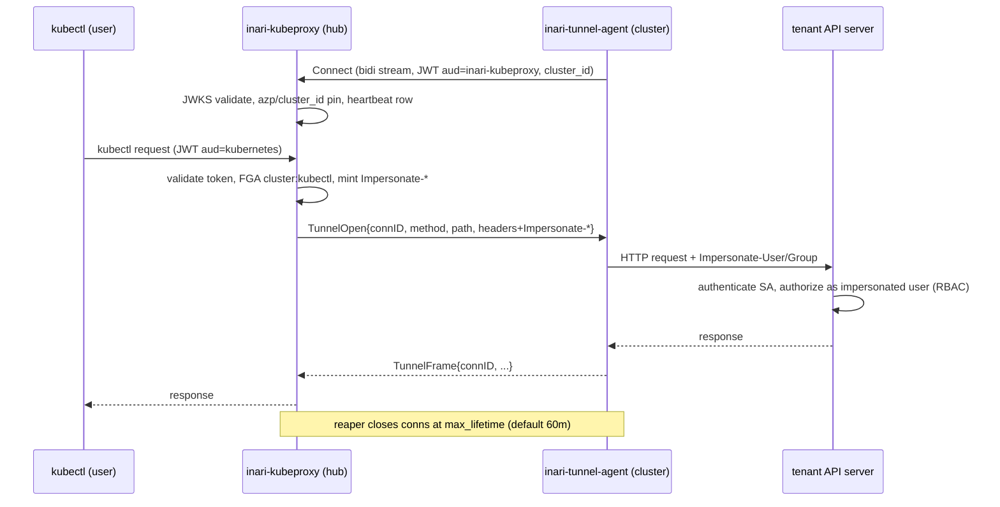

# ADR-0014: kubectl gateway — dedicated kubeproxy service + dedicated tunnel agent

Status: accepted (M1W6, implements plan §7.2)

## Context

Tenant clusters are pull-only: agents dial out, the control plane never
connects in, and no tenant credentials live on the hub (platform principles
2 and 3). Direct kubectl access (ADR: structured JWT authentication, plan
§5.4) requires the user's machine to reach the tenant API server, which is
not the normal case — most cluster APIs are private. Gateway mode closes
that gap: kubectl targets a control-plane endpoint that relays requests to
the cluster over an agent-initiated tunnel, authorizing them with the
user's own cluster RBAC via Kubernetes impersonation.

Industry consensus for this topology is consistent across the three
products we studied:

- **Rancher**: an in-cluster *cluster agent* dials out to the hub; the
  hub-side *steve* proxy relays API traffic over that stream. Data plane
  (proxy) and agent are separate components with separate identities.
- **Teleport**: *reverse-tunnel agents* dial out to the proxy service;
  a dedicated *kube_service* terminates Kubernetes traffic and forwards it
  with impersonation. Again a dedicated data-plane component.
- **Loft / vCluster**: the cluster connects out (loft agent / vCluster
  syncer) and the platform proxies kubectl over that connection.

All three converge on the same shape: a **separate data-plane proxy
component** on the hub plus an **in-cluster agent that initiates the
outbound tunnel** — never a module bolted onto the control-plane API, and
never inbound connections to the tenant.

The questions this ADR settles: where the proxy lives (modular monolith vs
dedicated service), whether the tunnel shares the fleet agent, the wire
protocol, the agent's identity and secret delivery, and the request
security model.

## Decision

1. **kubeproxy is a dedicated binary/deployable** (`cmd/inari-kubeproxy`,
   `internal/kubeproxy`), not a module inside the inari-server monolith.
   It is data plane: high-bandwidth, long-lived streams, latency-sensitive,
   and its availability must not be coupled to control-plane deploys (and
   vice versa — a runaway tunnel must not take down the API). It scales
   independently and can be deployed closer to users in future topologies.
2. **One dedicated tunnel agent per cluster**, separate from the fleet/
   operator agent: same image as inari-agent, run as a second Deployment
   with `command: ["/inari-tunnel-agent"]` and its own ServiceAccount
   holding **only** `impersonate` on users/groups/uids. The grant is never
   merged into the inari-agent SA, so revoking kubectl tunnel access can
   never break GitOps delivery, and a compromise of the fleet agent yields
   no impersonation power.
3. **Wire protocol**: h2c Connect bidirectional stream
   `inari.tunnel.v1.TunnelService/Connect` dialed by the agent; HTTP
   requests are muxed onto it as open/frame/close messages keyed by
   connID (`internal/kubeproxy/mux.go`). The agent re-creates hop-by-hop
   headers and relays to `https://kubernetes.default.svc` with its SA
   token. In-cluster only ever needs egress 443.
4. **Agent identity**: per-cluster Keycloak client `tunnel-<cluster-id>`
   — confidential, client-credentials only, hardcoded `cluster_id` claim,
   audience `inari-kubeproxy` — provisioned at cluster registration
   (`tenancy.EnsureTunnelClient`, idempotent). The kubeproxy stream
   interceptor validates the JWT statelessly via JWKS and pins `azp` to
   `tunnel-<cluster-id>`. The secret is delivered through the existing
   registration-time ESO mechanism as a second key
   (`tunnel-client-secret`, `agentgateway.TunnelSecretKey`) in the same
   cluster secret — zero new delivery machinery, zero tenant credentials
   at rest on the hub beyond the Vault write.
5. **User request security model**: kubeproxy terminates user TLS on
   `/proxy/*`; validates the Keycloak JWT statelessly (aud `kubernetes`);
   takes the tenant from the token, never the URL (coarse PEP); checks
   OpenFGA `cluster:kubectl` per request (cached, fail-open — fine PEP);
   strips all client-supplied `Impersonate-*` headers and mints its own
   (`Impersonate-User` = token subject, `Impersonate-Group` = the token's
   full group paths). The tenant API server's normal RBAC and audit see
   exactly the human's identity.
6. **Abuse bounds**: per-connection byte cap and a max-lifetime reaper
   (default 60m, `INARI_KUBEPROXY_MAX_TUNNEL_LIFETIME`) close connections
   with reason `max_lifetime`, bounding token-reuse windows and forcing
   periodic re-authorization; per-cluster kill switches
   (`DisableTunnelClient` reversible, `RevokeTunnelClient` terminal) plus
   a global flag (`kubectl_access.enabled` /
   `INARI_KUBECTL_ACCESS_ENABLED`, off → 410 for users and stream
   rejection for agents); audit events for client lifecycle and access
   flow to the shared outbox.

## Security model summary

Stateless JWKS validation on both legs (user aud `kubernetes`, agent aud
`inari-kubeproxy` + `azp`/`cluster_id` pinning); impersonation is minted
only at the hub; the tunnel agent holds no API permissions of its own, so
every tunneled request is authorized by the cluster as the human; FGA
`cluster:kubectl` is evaluated per request at the proxy; kill switches
exist at global, per-cluster, and per-client granularity; audit identity
(both real and impersonated) is preserved end to end.

## Deferred alternatives and revisit triggers

- **NATS frame bus** (`inari.tunnel.<clusterID>.<connID>` core-NATS
  ephemeral subjects, sketched in inari-docs ADR-0014): frames between
  kubeproxy and agent over JetStream/core NATS instead of a direct bidi
  stream. Deferred: the direct stream is operationally simpler (no second
  control loop, no subject ACL surface), and sessions are already fenced
  per cluster. **Revisit if** we run multi-region kubeproxy replicas where
  an agent must reach the nearest edge while sessions stay durable across
  replica failover, or if measured per-conn setup latency over the stream
  becomes a user-visible problem (target: open p95 > 500 ms sustained).
- **konnectivity** (Kubernetes SIG apiserver-network-proxy): a mature
  generic apiserver↔node proxy. Deferred: it solves generic node-level
  networking we do not need, its identity model is mTLS-agent based rather
  than our per-cluster OIDC client model, and vendoring it couples our
  release cadence to upstream. **Revisit if** we need non-HTTP tunnel
  payloads (arbitrary TCP to nodes/pods) or if maintaining our own mux
  exceeds the integration cost of konnectivity's agent.
- **Third-party kubectl gateway as an extension** via the
  extension-gateway (inari-docs ADR-0012): let a vendor extension
  terminate gateway traffic with OIDC passthrough/token exchange.
  Deferred: the extension identity model (per-extension identity,
  ADR-0008) does not yet carry per-user impersonation authority, and
  kubectl access is too security-critical to outsource before that
  matures. **Revisit when** the extension identity model supports
  per-request user attribution end to end and at least one concrete
  vendor need is on the roadmap.

## Consequences

- New deployable (kubeproxy) and new agent workload (tunnel-agent
  Deployment) to operate, monitor, and upgrade; the agent chart ships the
  tunnel Deployment by default, old agents degrade gracefully
  (`tunnelAvailable=false` → 503 + remediation, direct mode unaffected).
- Cluster registration does more work (tunnel client + second secret key);
  failures surface as `pending_secret_delivery` with the registration
  token left consumable.
- Impersonation power is concentrated in one tightly-scoped SA per
  cluster; rotation and revocation paths are documented in the operator
  guide.
- Gateway traffic transits the hub: bandwidth and latency costs are
  accepted as the price of zero inbound connectivity; the NATS frame bus
  remains the documented escape hatch.
